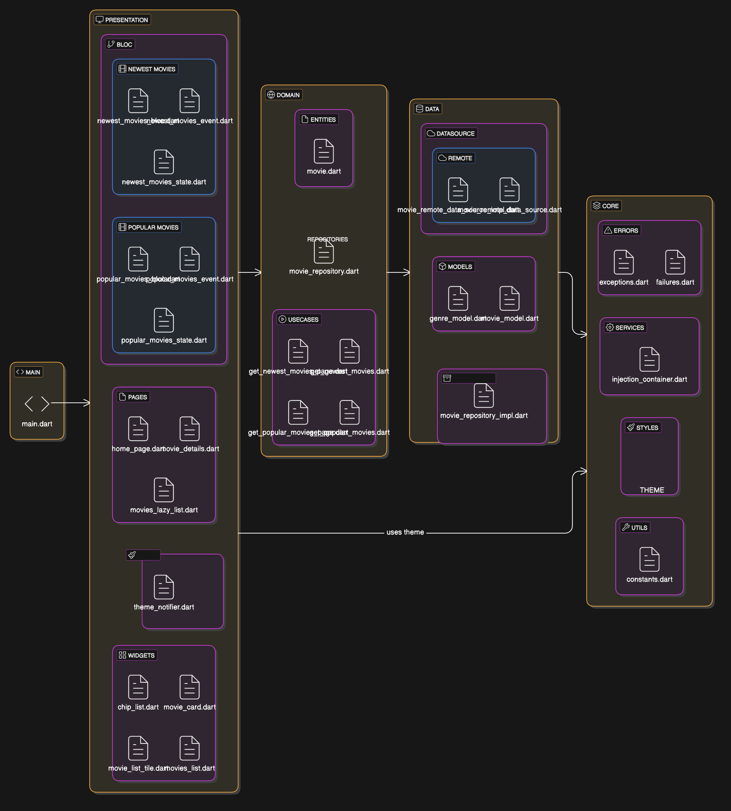

# popular_movies

A Flutter project that allows you to see the most recent and popular movies.

## Getting Started

Creat an .env file in the root of your project, add API_KEY and add your apikey from themoviedb.org

You should also add `BASE_URL="https://api.themoviedb.org/3"` in the same file

In this project I used Bloc for the state of the movies and provider for the Theme of the app

I also added a pagination when the user wants to see more popular or newest films, but instead
of having a page itself, it is an infinite scroller, implementing another package ["infinite_scroll_pagination"](https://pub.dev/packages/infinite_scroll_pagination)

 - flutter pub get
 - flutter run

 Diagram of the architecture

 